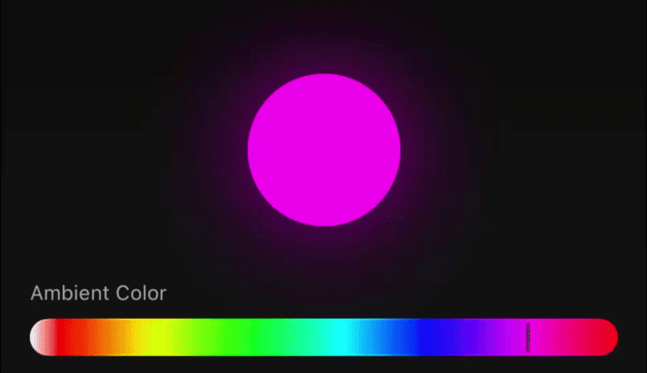
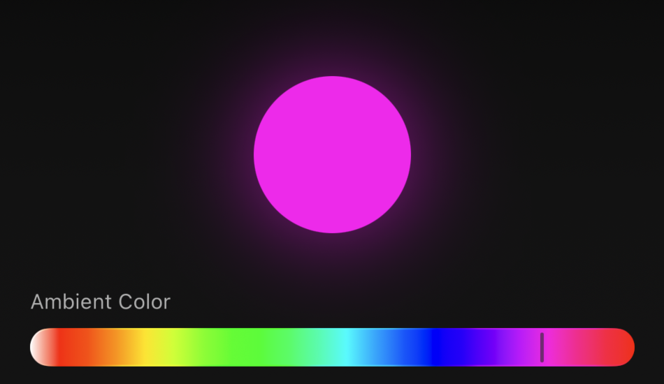

# FluidColorPicker

<p align="center">

  

</p>

A premium SwiftUI color picker with a fluid glass selector, live color binding, and modern Liquid Glass styling.

`FluidColorPicker` is a reusable horizontal spectrum picker built for polished Apple-style interfaces. It was originally designed for a starlight headliner controller app, where the selected color updates the ambient lighting preview in real time.

The component focuses on smooth interaction, clean SwiftUI architecture, and a premium visual feel.

---

## Preview

<p align="center">

  

</p>

```swift
@State var selectedColor: Color = .white
    ZStack {
        LinearGradient(
            colors: [
                .black,
                Color(hex: "111111"),
                Color(hex: "181618")
            ],
            startPoint: .top,
            endPoint: .bottom
        )
        .ignoresSafeArea()
        
        VStack(spacing: 32) {
            Circle()
                .fill(selectedColor)
                .frame(width: 90, height: 90)
                .shadow(color: selectedColor.opacity(0.8), radius: 30)
            
            FluidColorPicker(
                Text("Ambient Color")
                    .font(.caption)
                    .foregroundStyle(.white.opacity(0.7)),
                selection: $selectedColor
            )
            .padding(.horizontal, 28)
        }
    }
}
```

---

## Features

- Full-spectrum horizontal color bar
- Dedicated white color zone
- Live `@Binding` color selection
- Fluid animated glass selector
- Collapsing resting indicator
- Optional `Text` label
- Customizable pill size
- Customizable color bar height
- Customizable glass spacing
- Clean public initializer
- Organized SwiftUI structure with private helper extensions
- Manual animation handling to keep interaction smooth during drag updates

---

## Why I Built This

I built this component while designing a premium SwiftUI controller interface for a car starlight headliner system.

The goal was to make the color picker feel more polished than a standard slider. I wanted the interaction to feel smooth, physical, and modern while still keeping the component reusable.

During development, I ran into animation interruptions caused by `GlassEffectContainer` when the selector was dragged while expanding or collapsing. To solve that, I implemented a small cancellable manual animation helper so the floating pill animation stays smooth even while drag updates are happening.

---

## Example

```swift
import SwiftUI

struct DemoView: View {
    @State private var selectedColor: Color = .white

    var body: some View {
        ZStack {
            LinearGradient(
                colors: [
                    .black,
                    Color(red: 0.06, green: 0.06, blue: 0.06),
                    Color(red: 0.09, green: 0.08, blue: 0.09)
                ],
                startPoint: .top,
                endPoint: .bottom
            )
            .ignoresSafeArea()

            VStack(spacing: 32) {
                Circle()
                    .fill(selectedColor)
                    .frame(width: 90, height: 90)
                    .shadow(color: selectedColor.opacity(0.8), radius: 30)

                FluidColorPicker(
                    Text("Ambient Color")
                        .font(.caption)
                        .foregroundStyle(.white.opacity(0.7)),
                    selection: $selectedColor
                )
                .padding(.horizontal, 28)
            }
        }
    }
}
```

---

## API

```swift
public init(
    _ label: Text? = nil,
    selection: Binding<Color>,
    pillSize: CGFloat = 30,
    colorBarHeight: CGFloat = 22,
    glassSpacing: CGFloat? = nil,
    pillExtraSpacing: CGFloat = 4
)
```

### Parameters

| Parameter | Description |
|---|---|
| `label` | Optional `Text` label shown above the picker |
| `selection` | Binding to the selected `Color` |
| `pillSize` | Size of the floating glass selector |
| `colorBarHeight` | Height of the horizontal color bar |
| `glassSpacing` | Optional custom spacing for `GlassEffectContainer` |
| `pillExtraSpacing` | Extra spacing between the color bar and floating selector |

---

## Usage

### Basic

```swift
@State private var currentColor: Color = .white

FluidColorPicker(selection: $currentColor)
```

### With a Label

```swift
FluidColorPicker(
    Text("Pick a color")
        .font(.caption)
        .foregroundStyle(.secondary),
    selection: $currentColor
)
```

### Customized

```swift
FluidColorPicker(
    Text("Ambient Color")
        .font(.caption)
        .foregroundStyle(.white.opacity(0.7)),
    selection: $currentColor,
    pillSize: 42,
    colorBarHeight: 24,
    pillExtraSpacing: 6
)
```

---

## Implementation Notes

The floating selector is drawn behind the bar using a background layer so it does not affect the picker’s layout height.

The component uses manual animation for the floating selector because normal implicit SwiftUI animations can be interrupted when `GlassEffectContainer` recalculates glass merging during drag updates.

This keeps the interaction smooth even if the user starts dragging before the expansion animation finishes.

---

## Requirements

- iOS 26+
- SwiftUI

This component is designed for modern SwiftUI interfaces using Apple’s Liquid Glass design language.

---

## License

MIT License

This project is open source and available under the terms of the MIT License.

---

## Author

Created by **ih8coconuts**

Built as part of a premium SwiftUI starlight headliner controller interface.
